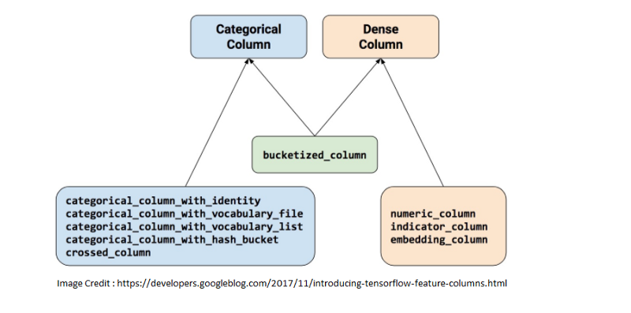
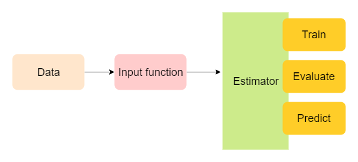

# Introduction to Tensorflow Estimators 

[link](https://medium.com/learning-machine-learning/introduction-to-tensorflow-estimators-part-1-39f9eb666bc7)

## Introducing Tensorflow Estimators

Estimators is a high level API integrated with Tensorflow that allows us to work with pre-implemented models 
and provides tools for quickly creating new models as need by customizing them. The interface is loosely scikit-learn
inspired and follows a train-evaluate-predict loop similar to scikit-learn. `Estimators` is the base class, canned 
estimators or pre-implemented models are the sub-class.

Also, please consult the excellent research paper: "Tensorflow Estimators: Managing Simplicity Vs Flexibility In High 
Level Machine Learning FrameWorks" for further learning. 

Esitmators deal with all the details of creating computational graphs, initializing variables, training the model and 
saving chechpoint and logging files for Tensorboard behind the scene. But to work with the estimators, we've to become 
comfortable with two new concepts, **feature columns and input functions**. Input functions are used for passing input 
data to the model for training and evaluation. Feature columns are specifications for how the model should interpret 
the input data. 

Since we are going to learn via doing, we can start analyzing from beginning where we are now and where we have to go.
We know that we have some training data on airbnb rental pricings and their prices. We want to predict the prices of 
those rentals from the features in the dataset. We also know that we need a machine learning model to do that. 
Tensorflow is offering pre-made model implementations for doing it and giving functionality for representing our 
features in different ways using the feature columns. We just need to build an input function and send our data to the 
estimator. Feature columns will connect the data from the input function to the estimators for training and evaluating 
the model.

Our general workflow will be to follow these steps:

1. Loading the libraries and dataset.

2. Data preprocessing.

3. Defining the feature columns.

4. Building input function.

5. Model instantiation, training and evaluation.

6. Generating prediction.

7. Visualizing the model and the loss metrics using Tensorboard.

## Introducing Feature Columns

Generally, machine learning models take numbers as input and outputs numbers for efficient implementation. In 
Tensorflow, the models take Dense `Tensor`s as input and output Dense `Tensor`s. But real world datasets have sparse
features like product id, category, location, video id etc. For large datasets, converting each of the `cateforical
features to numerical representations` often consume a huge amount of time and the process is also error prone. There 
are also other feature preprocessing steps like bucketization, scaling, crossing features, embedding etc people often 
take before feeding the data to the models. To simplify this process Tensorflow offers `FeatureColumn` abstraction.

When we instantiate a canned estimator we have to pass it a list of `FeatureColumn`s for the `feature_column` parameter.
`FeatureColumn`s handle the conversion of the spars or dense (numerical) features to a dense `Tensor` usable by the core
model.

The type of Feature column to use depends on the feature type and the model type.

* Feature type: Numeric and categorical features need to be handled differently.

* Model type: Linear models and the neural network models handle categorical features differently.



In this tutorial we'll show how to handle numeric and the categorical features with two different `FeatureColumn`. 
To learn more about this topic, you can consult a great [tutorial](https://developers.googleblog.com/2017/11/introducing-tensorflow-feature-columns.html)
published by the Tensorflow team in Google Research Blog.

First we'll separate the column names of the numeric features and the categorical features.

```
# get all the numeric feature names
numeric_columns = [
    'host_total_listings_count',
    'accommodates',
    'bathrooms',
    'bedrooms',
    'beds',
    'security_deposit',
    'cleaning_fee',
    'minimum_nights',
    'number_of_reviews',
    'review_scores_value'
]

# get all the categorical feature names that contains strings
categorical_columns = [
    'host_is_superhost',
    'neighbourhood_cleansed',
    'property_type',
    'room_type',
    'bed_type',
    'instant_bookable'
]
```

### Numeric Feature Columns

Numeric features can be represented by `numeric_column` which is used for real valued features. When we crate a 
`numeric_column` we have to pass a unique string to its `key` parameter. The value of `key` will be used as the name of
the column. We can also specify the data type or shape of the `numeric_column` if necessary.

We use a list comprehension to create `numeric_columns` for all the numeric features. We basically create a 
`numeric_column` for each column in the `numeric_column` list.

```
numeric_features = [tf.feature_column.numeric_column(key=column) for column in numeric_columns]
```

### Categorical Feature Columns

There are many ways to handle categorical features in tensorflow. `cateforical_column_with_vocabulary_list` is just one 
of them. For small number of categories we give the categorical column the fixed list of values the column will take.
It represents each categorical feature in it's one-hot vector representation.

In the one hot representation we replace each categorical instance with a n-dimensional boolean vector which has the 
size of the number of categories in the feature and marks the presence and absence of each category with 1 and 0. For
example if we have a feature "Gender" with two categories {male, female}, each time we see "male" we will replace it 
with a vector \[1, 0\] and each time we see "female" we'll replace it with a vector \[0,1\].

`categorical_column_with_vocabulary_list` must have following inputs:

* key: a unique string identifying the input feature which would be used as the name of the column.

* vocabulary_list: an ordered list defining the possible values for this categorical feature

Other feature columns for categorical features are:

* `categorical_column_with_identity`: Returns the column as it is.

* `categorical_column_from_vocabulary_file`: Instead of giving the column values in a list, we read it from a file.

* `categorical_column_with_hash_bucket`: If the number of values a categorical column can take is really large, 
instead of writing all the possible values in a list and giving it, we can use hashing to let tensorflow take care of
it behind the scene. But there's a chance of 'hash collision' where two or more categories can be mapped to same place.

* `crossed_column`: We can cross a categorical feature with a numerical or another categorical feature. For example, 
let's say we take a categorical feature "Gender" and another feature "Education", we can create new features like 
"female_x_phd" or "female_x_bachelors".

```
cateforical_features = [
    tf.feature_column.categorical_column_with_vocabulary_list(key=column, vocabulary_list=features[column].unique())
    for column in categorical_columns
]

"""
output:

_VocabularyListCategoricalColumn(
    key='room_type', 
    vocabulary_list=('Entire home/apt', 'Private room', 'Shared room'), 
    dtype=tf.string, 
    default_value=-1, 
    num_oov_buckets=0
)
"""
``` 

## Build Input Function

When we train our model we have to pass the features and the labels to the model. Estimators require that we use 
an input function for this.

The input function must return a typle containing two elements.

1. A dictionary that contains the feature column names as key and maps them to the tensors containing the feature data 
for a training batch.

2. A list of labels for the training batch. 



Luckily tensorflow provides functionality for feeding a pandas Dataframe straight into a tensorflow estimator with the
`pandas_input_fn` function. `pandas_input_fn` has many parameters but we will use the following.

* `x`: pandas `DataFrame` object that has the features.

* `y`: pandas `Series` object that has the labels.

* `batch_size`: a number specifying the batch size.

* `shuffle`: boolean, whether to shuffle the data or not.

* `num_epoch`: int, number of epochs to iterate over the data. One epoch means going over all the training data once. 
None means it will cycle through input data forever.

Note that `pandas_input_fn` returns an input function that would feed the data to the tensorflow model. Here we create 
two input functions `training_input_fn` and `eval_input_fn` that takes the training and test set features and labels 
respectively.

`num_epoch` is set to `None` in the `training_input_fn` because we want to go over the training dataset multiple times 
as the model trains. We want to go over the test dataset only once to evaluate the model, so we set `num_epoch` to 1.

```
# create training input function
training_input_fn = tf.estimator.inputs.pandas_input_fn(x=x_train,
                                                        y=y_train,
                                                        batch_size=32,
                                                        shuffle=True,
                                                        num_epochs=None)

# create testing input function
testing_input_fn = tf.estimator.inputs.pandas_input_fn(x=x_train,
                                                       y=y_train,
                                                       batch_size=32,
                                                       shuffle=False,
                                                       num_epochs=1)
``` 

## Instantiate Model

We instantiate the linear model by passing the list containing the feature columns to the `feature_columns` parameter. 
We also specify a model directory with the `model_dir` parameter where tensorflow will store the model graph and other 
information. We'll be able to visualize the model architecture and the loss metrics later with tensorboard using them.

We choose different optimizers by using the `optimizer` parameter, but we'll go with the defaults here. The default 
loss function is sum of squared errors. If you want to customize the loss function or extend other properties, you can 
check out [Creating Estimators in Tensorflow](https://www.tensorflow.org/guide/custom_estimators) guide.

```
linear_regressor = tf.estimator.LinearRegressor(feature_columns=linear_features, model_dir="linear_regressor")
```

## Train Model

We pass the `training_input_fn` to the `input_fn` parameter of the `train` method and specify the number of steps we 
want to train the model. Note that we have to pass the function object (`input_fn=training_input_fn`) to the `input_fn`
parameter, not the return value of the function call.

```
linear_regressor.train(input_fn=training_input_fn, steps=2000)
``` 

## Evaluate Model

For evaluating the model we simply pass the `eval_input_fn` to the `input_fn` parameter in `regressor.evaluate` method 
as we did earlier with the `fit` method. It returns a `dict` containing loss after evaluating the model on the test set.
Currently loss is defined as mean squared err(MSE) in the `LinearRegressor` model.

```
linear_regressor.evaluate(input_fn=eval_input_fn)
``` 

`LinearRegressor.predict` method returns a `generator` for yielding predictions. Since we have set the `num_epoch` to 1 
the input function we are using to feed the data to the evaluation function will go over the test dataset only once. We 
can easily convert it to a list for getting the predictions.

```
pred = list(linear_regressor.predict(input_fn=eval_input_fn))
pred = [p['predictions][0] for p in pred]
``` 

Since we had log-transformed the price before we've to use the exponential function to inverse it and get our prices 
for the rental values in original dollar terms.

```
prices = np.exp(pred)
print(prices)
```

